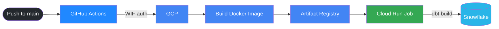

# Running dbt Models on Google Cloud Run

This guide covers the one-time GCP setup and the ongoing deployment process for running dbt (Snowflake) models via Cloud Run Jobs, triggered by GitHub Actions.

---

## How it works

```
Push to main branch
  → GitHub Actions authenticates to GCP (via Workload Identity Federation)
  → Builds a Docker image of the dbt project
  → Pushes image to Artifact Registry
  → Creates / updates a Cloud Run Job with Snowflake credentials
  → Executes the Cloud Run Job (runs `dbt build`)
```



---

## Project structure

```
dbt-airflow-test/
├── .github/
│   └── workflows/
│       └── deploy-dbt.yml        ← GitHub Actions pipeline
├── dbt_airflow_test/
│   ├── models/
│   ├── seeds/
│   ├── Dockerfile                ← Used by Cloud Run (do not confuse with root Dockerfile)
│   ├── requirements.txt          ← dbt-core + dbt-snowflake
│   └── profiles.yml              ← Reads credentials from env vars
├── Dockerfile                    ← Used by local Airflow only — do not modify
└── docker-compose.yaml           ← Used by local Airflow only — do not modify
```

---

## Step 1 — Set up GCP (one-time)

Set your shell variables first:

```bash
export PROJECT_ID="your-gcp-project-id"
export REGION="us-central1"
export SA_NAME="github-actions-dbt"
export SA_EMAIL="${SA_NAME}@${PROJECT_ID}.iam.gserviceaccount.com"
export POOL_NAME="github-dbt-pool"
export PROVIDER_NAME="github-dbt-provider"
export GITHUB_ORG_OR_USER="your-github-username-or-org"
export REPOSITORY="dbt-images"
```

### 1a. Create a Service Account

```bash
gcloud iam service-accounts create $SA_NAME \
    --project=$PROJECT_ID \
    --display-name="GitHub Actions dbt Service Account"
```

### 1b. Create an Artifact Registry repository

```bash
gcloud artifacts repositories create $REPOSITORY \
    --repository-format=docker \
    --location=$REGION \
    --description="Docker images for dbt" \
    --project=$PROJECT_ID
```

### 1c. Create a Workload Identity Pool and Provider

```bash
# Pool
gcloud iam workload-identity-pools create $POOL_NAME \
    --project=$PROJECT_ID \
    --location="global" \
    --display-name="GitHub Actions Pool"

# Provider
gcloud iam workload-identity-pools providers create-oidc $PROVIDER_NAME \
    --project=$PROJECT_ID \
    --location="global" \
    --workload-identity-pool=$POOL_NAME \
    --display-name="GitHub Provider" \
    --issuer-uri="https://token.actions.githubusercontent.com" \
    --attribute-mapping="google.subject=assertion.sub,attribute.repository=assertion.repository,attribute.actor=assertion.actor" \
    --attribute-condition="assertion.repository_owner == '${GITHUB_ORG_OR_USER}'"
```

### 1d. Grant IAM permissions

```bash
export PROJECT_NUMBER=$(gcloud projects describe $PROJECT_ID --format="value(projectNumber)")

# Allow GitHub Actions to impersonate the Service Account
gcloud iam service-accounts add-iam-policy-binding $SA_EMAIL \
    --project=$PROJECT_ID \
    --role="roles/iam.workloadIdentityUser" \
    --member="principalSet://iam.googleapis.com/projects/${PROJECT_NUMBER}/locations/global/workloadIdentityPools/${POOL_NAME}/attribute.repository/${GITHUB_ORG_OR_USER}/$(basename $(git rev-parse --show-toplevel))"

# Artifact Registry write access
gcloud projects add-iam-policy-binding $PROJECT_ID \
    --member="serviceAccount:$SA_EMAIL" \
    --role="roles/artifactregistry.writer"

# Cloud Run Job admin access
gcloud projects add-iam-policy-binding $PROJECT_ID \
    --member="serviceAccount:$SA_EMAIL" \
    --role="roles/run.admin"

# Service Account user (needed to deploy Cloud Run Jobs)
gcloud projects add-iam-policy-binding $PROJECT_ID \
    --member="serviceAccount:$SA_EMAIL" \
    --role="roles/iam.serviceAccountUser"
```

---

## Step 2 — Add secrets to GitHub

In your GitHub repository go to **Settings → Secrets and variables → Actions** and add the following secrets under the `prod` environment:

| Secret name | Value |
|---|---|
| `SNOWFLAKE_ACCOUNT` | Your Snowflake account identifier |
| `SNOWFLAKE_USER` | Snowflake username |
| `SNOWFLAKE_PASSWORD` | Snowflake password |
| `SNOWFLAKE_ROLE` | Snowflake role |
| `SNOWFLAKE_DATABASE` | Target database |
| `SNOWFLAKE_WAREHOUSE` | Compute warehouse |
| `SNOWFLAKE_SCHEMA` | Target schema |

---

## Step 3 — Configure the GitHub Actions workflow

Update the environment variables at the top of `.github/workflows/deploy-dbt.yml` to match your GCP project:

```yaml
env:
  PROJECT_ID: "your-gcp-project-id"
  GAR_LOCATION: "us-central1"
  REPOSITORY: "dbt-images"
  IMAGE_NAME: "dbt-snowflake"
  JOB_NAME: "dbt-snowflake-production-job"
  WIF_PROVIDER: "projects/PROJECT_NUMBER/locations/global/workloadIdentityPools/POOL_NAME/providers/PROVIDER_NAME"
  GCP_SERVICE_ACCOUNT: "github-actions-dbt@your-gcp-project-id.iam.gserviceaccount.com"
```

Get the full WIF provider path with:

```bash
gcloud iam workload-identity-pools providers describe $PROVIDER_NAME \
    --project=$PROJECT_ID \
    --location="global" \
    --workload-identity-pool=$POOL_NAME \
    --format="value(name)"
```

---

## Step 4 — Deploy

Push your code to the `main` branch. GitHub Actions will automatically:

1. Authenticate to GCP
2. Build the Docker image from `dbt_airflow_test/`
3. Push it to Artifact Registry
4. Create or update the Cloud Run Job with Snowflake env vars
5. Execute the job — runs `dbt build` inside the container

```bash
git add .
git commit -m "deploy dbt models"
git push origin main
```

Monitor the run in **GitHub → Actions** or in the **GCP Console → Cloud Run → Jobs**.

---

## Triggering manually

To re-run without a code change, trigger the workflow manually from **GitHub → Actions → Build and Run dbt on Cloud Run → Run workflow**, or execute the Cloud Run Job directly:

```bash
gcloud run jobs execute dbt-snowflake-production-job \
    --region=us-central1 \
    --wait
```