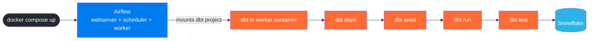

# Running dbt Models Locally via Airflow

Both Airflow and dbt run locally inside Docker containers. Airflow orchestrates the dbt commands via a DAG, and the dbt project is mounted directly into the containers — no cloud infrastructure needed.

---

## How it works

```
docker compose up
  → Airflow (webserver + scheduler + worker) starts in Docker
  → dbt project folder is mounted into the worker container
  → DAG dbt_snowflake_pipeline is available in the Airflow UI
  → Trigger the DAG → runs: dbt deps → dbt seed → dbt run → dbt test
  → Results land in your Snowflake schema
```



---

## Project structure

```
dbt-airflow-test/
├── dags/
│   └── dbt_snowflake_dag.py      ← Airflow DAG (dbt deps → seed → run → test)
├── dbt_airflow_test/             ← dbt project, mounted into the worker container
│   ├── models/
│   ├── seeds/
│   └── profiles.yml              ← Reads credentials from env vars set by the DAG
├── Dockerfile                    ← Custom Airflow image with dbt installed
└── docker-compose.yaml           ← Spins up Airflow + Postgres + Redis
```

The `docker-compose.yaml` mounts `dbt_airflow_test/` to `/home/airflow/gcs/data/dbt_airflow_test` inside every container. That is the path the DAG uses.

---

## Step 1 — Prerequisites

- Docker Desktop installed and running
- At least **4 GB memory** and **2 CPUs** allocated to Docker
- Port **8080** free (Airflow UI)
- A Snowflake account with a role, warehouse, database, and schema already created

---

## Step 2 — Build the custom Airflow image

The root `Dockerfile` extends the official Airflow image and installs dbt:

```dockerfile
FROM apache/airflow:2.11.1
USER root
RUN apt-get update && apt-get install -y --no-install-recommends git && apt-get clean
USER airflow
RUN pip install --no-cache-dir \
    "dbt-core==1.11.11" \
    "dbt-snowflake==1.11.5" \
    "protobuf>=4.25,<6"
```

> **Note:** Keep `protobuf` below version 6. Using protobuf 6.x with dbt-core 1.11.x causes `MessageToJson()` errors.

In `docker-compose.yaml`, make sure the `build` line is active instead of the pre-built `image` line:

```yaml
# Comment out this line:
# image: ${AIRFLOW_IMAGE_NAME:-apache/airflow:2.11.1}

# Uncomment this line:
build: .
```

Then build the image from the repository root:

```bash
docker compose build --no-cache
```

---

## Step 3 — Add Snowflake credentials to Airflow

The DAG reads Snowflake credentials from **Airflow Variables** and injects them as environment variables for dbt.

First start the services (next step), then go to **Airflow UI → Admin → Variables** and add:

| Key | Value |
|---|---|
| `snowflake_account` | Your Snowflake account identifier |
| `snowflake_user` | Snowflake username |
| `snowflake_password` | Snowflake password |
| `snowflake_role` | Snowflake role |
| `snowflake_database` | Target database |
| `snowflake_warehouse` | Compute warehouse |
| `snowflake_schema` | Target schema |

> **Tip:** You can bulk-import all variables at once via **Admin → Variables → Import Variables** using a JSON file. Create a file (e.g. `airflow_variables.json`) with the following structure and upload it:
>
> ```json
> {
>   "snowflake_account": "your_account",
>   "snowflake_user": "your_user",
>   "snowflake_password": "your_password",
>   "snowflake_role": "your_role",
>   "snowflake_database": "your_database",
>   "snowflake_warehouse": "your_warehouse",
>   "snowflake_schema": "your_schema"
> }
> ```
>
> Keep this file out of version control — add it to `.gitignore`.

---

## Step 4 — Start Airflow

From the repository root, initialise the database (first time only):

```bash
docker compose up airflow-init
```

Then start all services:

```bash
docker compose up -d
```

Open the Airflow UI at **http://localhost:8080**

- Username: `airflow`
- Password: `airflow`

---

## Step 5 — Verify the setup

Confirm the dbt project is mounted correctly inside the worker:

```bash
docker compose exec airflow-worker ls -la /home/airflow/gcs/data/dbt_airflow_test
```

You should see `dbt_project.yml` and the `models/`, `seeds/` folders.

---

## Step 6 — Trigger the DAG and validate

1. In the Airflow UI, find the DAG **`dbt_snowflake_pipeline`** and unpause it
2. Click **Trigger DAG** (play button)
3. The tasks run in this order:

   ```
   dbt_deps → dbt_seed → dbt_run → dbt_test
   ```

   - `dbt_deps` — installs any dbt packages
   - `dbt_seed` — loads `seeds/customer_seed.csv` into Snowflake
   - `dbt_run` — builds the `customer_seed_view` model
   - `dbt_test` — runs dbt tests

4. Click each task to view its logs
5. Verify the resulting table/view in your Snowflake schema

> **Note:** `dbt debug` is intentionally skipped. Running it inside the container causes git permission errors because the container has no git credentials. It is safe to skip — it is only a connectivity check.

---

## Troubleshooting

| Symptom | Cause | Fix |
|---|---|---|
| `dbt: command not found` in task logs | dbt not installed in the image | Run `docker compose build --no-cache` and restart |
| `MessageToJson() unexpected keyword argument` | protobuf 6.x installed | Pin `protobuf>=4.25,<6` in `Dockerfile` and rebuild |
| `profiles.yml not found` | Wrong working dir in BashOperator | Ensure task uses `cd /home/airflow/gcs/data/dbt_airflow_test && dbt ... --profiles-dir .` |
| Snowflake auth errors | Wrong variable values or missing Snowflake grants | Check **Admin → Variables** and verify role/warehouse/schema grants in Snowflake |
| DAG not visible in UI | DAG parse/import error | Run `docker compose logs airflow-scheduler --tail=200` to see the error |

---

## Useful commands

```bash
# Stop all services
docker compose down

# Stop and remove all volumes (full reset)
docker compose down -v

# Rebuild image after changing Dockerfile or dependencies
docker compose build --no-cache

# Follow worker logs (see dbt output)
docker compose logs -f airflow-worker

# Follow scheduler logs (see DAG parse errors)
docker compose logs -f airflow-scheduler
```
