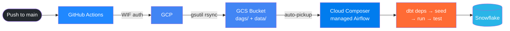

# Running dbt Models on GCP Cloud Composer (Managed Airflow)

> **⚠️ Setup incomplete — not recommended for small/personal projects**
> This setup was not fully completed due to the high upfront running costs of Cloud Composer. Even idle, a Composer environment keeps a GKE cluster and a Cloud SQL (PostgreSQL) database running 24/7, which adds up quickly. For a project at this scale, the Cloud Run approach ([readme_cloudrun.md](readme_cloudrun.md)) is a much cheaper alternative — it only runs when triggered.

Cloud Composer (GCP's managed Airflow) orchestrates dbt runs against Snowflake. Code is deployed from GitHub via GitHub Actions — no manual file uploads needed.

---

## How it works

```
Push to main branch
  → GitHub Actions authenticates to GCP (via Workload Identity Federation)
  → Syncs dags/ and dbt_airflow_test/ to the Composer GCS bucket
  → Cloud Composer auto-picks up the DAG from the bucket
  → DAG dbt_snowflake_pipeline is available in the Airflow UI
  → Trigger the DAG → runs: dbt deps → dbt seed → dbt run → dbt test
  → Results land in your Snowflake schema
```



---

## Project structure

```
dbt-airflow-test/
├── .github/
│   └── workflows/
│       └── deploy-composer.yml   ← GitHub Actions pipeline (syncs to GCS)
├── dags/
│   └── dbt_snowflake_dag.py      ← Airflow DAG
├── dbt_airflow_test/             ← dbt project, synced to Composer GCS bucket
│   ├── models/
│   ├── seeds/
│   └── profiles.yml              ← Reads credentials from env vars set by the DAG
├── Dockerfile                    ← Local Airflow only — do not modify
└── docker-compose.yaml           ← Local Airflow only — do not modify
```

Path mapping inside Composer workers:

| GCS path | Worker path |
|---|---|
| `gs://<COMPOSER_BUCKET>/dags/` | `/home/airflow/gcs/dags/` |
| `gs://<COMPOSER_BUCKET>/data/dbt_airflow_test/` | `/home/airflow/gcs/data/dbt_airflow_test/` |

---

## Step 1 — Set up GCP (one-time)

### 1a. Create a Cloud Composer environment

Create a Composer 2 environment from the GCP Console or CLI. Note the **GCS bucket name** assigned to it — you will need it throughout.

### 1b. Create a GitHub Actions service account

```bash
export PROJECT_ID="your-gcp-project-id"
export SA_NAME="github-actions-composer"
export SA_EMAIL="${SA_NAME}@${PROJECT_ID}.iam.gserviceaccount.com"
export COMPOSER_BUCKET="your-composer-bucket-name"
export POOL_NAME="github-composer-pool"
export PROVIDER_NAME="github-composer-provider"
export GITHUB_ORG_OR_USER="your-github-username-or-org"

gcloud iam service-accounts create $SA_NAME \
    --project=$PROJECT_ID \
    --display-name="GitHub Actions Composer Deployer"
```

### 1c. Grant IAM permissions

```bash
export PROJECT_NUMBER=$(gcloud projects describe $PROJECT_ID --format="value(projectNumber)")

# Storage access to sync files into the Composer bucket
gcloud storage buckets add-iam-policy-binding gs://$COMPOSER_BUCKET \
    --member="serviceAccount:$SA_EMAIL" \
    --role="roles/storage.objectAdmin"

# Allow GitHub Actions to impersonate the service account via WIF
gcloud iam service-accounts add-iam-policy-binding $SA_EMAIL \
    --project=$PROJECT_ID \
    --role="roles/iam.workloadIdentityUser" \
    --member="principalSet://iam.googleapis.com/projects/${PROJECT_NUMBER}/locations/global/workloadIdentityPools/${POOL_NAME}/attribute.repository/${GITHUB_ORG_OR_USER}/$(basename $(git rev-parse --show-toplevel))"
```

### 1d. Create a Workload Identity Pool and Provider

```bash
# Pool
gcloud iam workload-identity-pools create $POOL_NAME \
    --project=$PROJECT_ID \
    --location="global" \
    --display-name="GitHub Actions Pool"

# Provider
gcloud iam workload-identity-pools providers create-oidc $PROVIDER_NAME \
    --project=$PROJECT_ID \
    --location="global" \
    --workload-identity-pool=$POOL_NAME \
    --display-name="GitHub Provider" \
    --issuer-uri="https://token.actions.githubusercontent.com" \
    --attribute-mapping="google.subject=assertion.sub,attribute.repository=assertion.repository,attribute.actor=assertion.actor" \
    --attribute-condition="assertion.repository_owner == '${GITHUB_ORG_OR_USER}'"
```

### 1e. Install dbt packages in Composer

In the GCP Console go to **Cloud Composer → your environment → PyPI packages** and add:

| Package | Version |
|---|---|
| `dbt-core` | `==1.11.11` |
| `dbt-snowflake` | `==1.11.5` |
| `protobuf` | `>=4.25,<6` |

> **Important:** Keep `protobuf` below version 6. Using protobuf 6.x with dbt-core 1.11.x causes `MessageToJson()` errors at runtime.

---

## Step 2 — Add Snowflake credentials to Airflow

The DAG reads Snowflake credentials from **Airflow Variables** and injects them as environment variables for dbt.

In the Composer Airflow UI go to **Admin → Variables** and add:

| Key | Value |
|---|---|
| `snowflake_account` | Your Snowflake account identifier |
| `snowflake_user` | Snowflake username |
| `snowflake_password` | Snowflake password |
| `snowflake_role` | Snowflake role |
| `snowflake_database` | Target database |
| `snowflake_warehouse` | Compute warehouse |
| `snowflake_schema` | Target schema |

> **Tip:** You can bulk-import all variables at once via **Admin → Variables → Import Variables** using a JSON file:
>
> ```json
> {
>   "snowflake_account": "your_account",
>   "snowflake_user": "your_user",
>   "snowflake_password": "your_password",
>   "snowflake_role": "your_role",
>   "snowflake_database": "your_database",
>   "snowflake_warehouse": "your_warehouse",
>   "snowflake_schema": "your_schema"
> }
> ```
>
> Keep this file out of version control — add it to `.gitignore`.

For production, consider storing sensitive values in **Secret Manager** and referencing them via the Airflow Secret Manager backend instead of plain Variables.

---

## Step 3 — Configure the GitHub Actions workflow

In `.github/workflows/deploy-composer.yml` set the environment variables to match your project:

```yaml
env:
  PROJECT_ID: "your-gcp-project-id"
  COMPOSER_BUCKET: "your-composer-bucket-name"
  WIF_PROVIDER: "projects/PROJECT_NUMBER/locations/global/workloadIdentityPools/POOL_NAME/providers/PROVIDER_NAME"
  GCP_SERVICE_ACCOUNT: "github-actions-composer@your-gcp-project-id.iam.gserviceaccount.com"
```

The deploy step syncs both folders to the bucket:

```bash
gsutil -m rsync -r dags gs://$COMPOSER_BUCKET/dags
gsutil -m rsync -r dbt_airflow_test gs://$COMPOSER_BUCKET/data/dbt_airflow_test
```

Get the full WIF provider path with:

```bash
gcloud iam workload-identity-pools providers describe $PROVIDER_NAME \
    --project=$PROJECT_ID \
    --location="global" \
    --workload-identity-pool=$POOL_NAME \
    --format="value(name)"
```

---

## Step 4 — Deploy

Push your code to the `main` branch. GitHub Actions will automatically sync files to Composer:

```bash
git add .
git commit -m "deploy dbt models to composer"
git push origin main
```

Cloud Composer picks up changes from the GCS bucket within a minute. Monitor the sync in **GitHub → Actions**.

---

## Step 5 — Trigger the DAG and validate

1. Open the **Airflow UI** for your Composer environment (GCP Console → Cloud Composer → your env → Airflow UI link)
2. Find the DAG **`dbt_snowflake_pipeline`** and unpause it
3. Click **Trigger DAG**
4. The tasks run in this order:

   ```
   dbt_deps → dbt_seed → dbt_run → dbt_test
   ```

   - `dbt_deps` — installs any dbt packages
   - `dbt_seed` — loads `seeds/customer_seed.csv` into Snowflake
   - `dbt_run` — builds the `customer_seed_view` model
   - `dbt_test` — runs dbt tests

5. Click each task to view its logs
6. Verify the resulting table/view in your Snowflake schema

---

## Troubleshooting

| Symptom | Cause | Fix |
|---|---|---|
| `dbt: command not found` in task logs | dbt not installed in Composer PyPI packages | Add `dbt-core` and `dbt-snowflake` under Composer → PyPI packages and wait for environment update |
| `MessageToJson() unexpected keyword argument` | protobuf 6.x installed | Pin `protobuf>=4.25,<6` in Composer PyPI packages |
| `dbt project path not found` | `dbt_airflow_test/` not synced to GCS | Verify `gs://<COMPOSER_BUCKET>/data/dbt_airflow_test/` exists and contains `dbt_project.yml` |
| Snowflake auth errors | Wrong variable values or missing Snowflake grants | Check **Admin → Variables** and verify role/warehouse/schema grants in Snowflake |
| DAG not visible in UI | Sync did not run or DAG has a parse error | Check GitHub Actions logs and verify `gs://<COMPOSER_BUCKET>/dags/dbt_snowflake_dag.py` exists |
